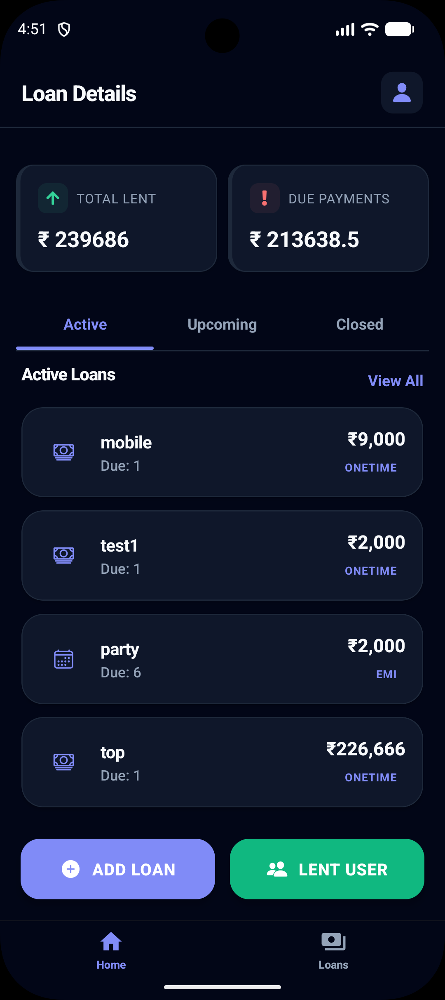
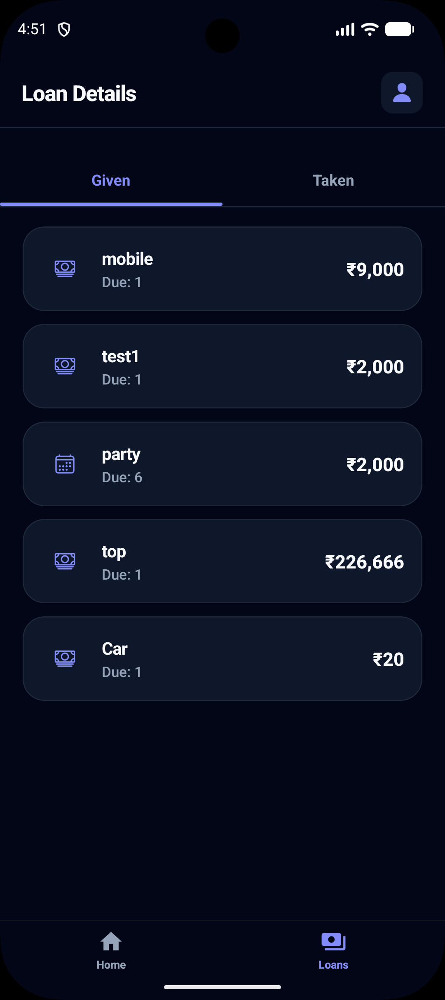
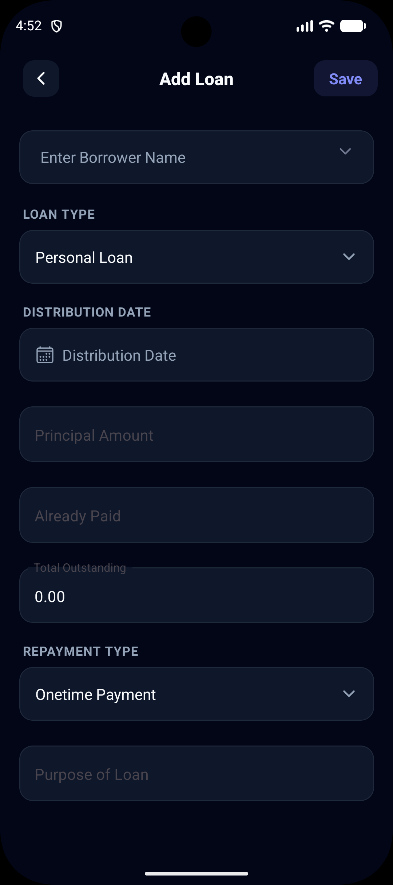
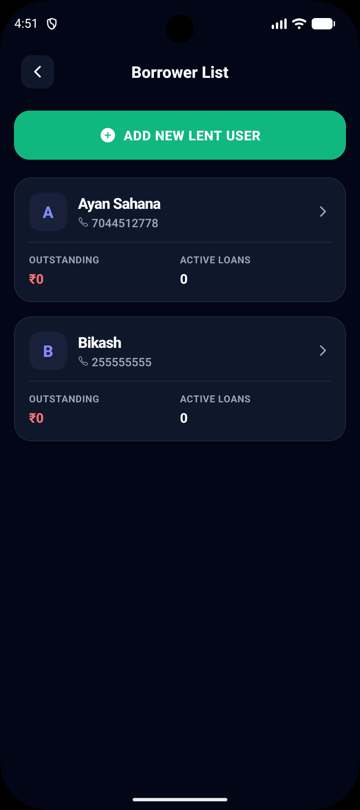
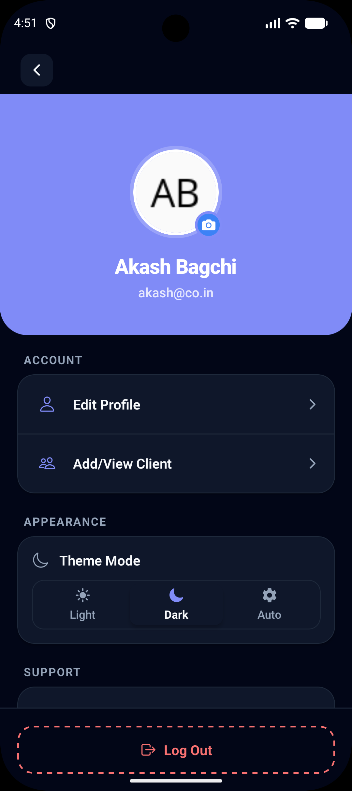
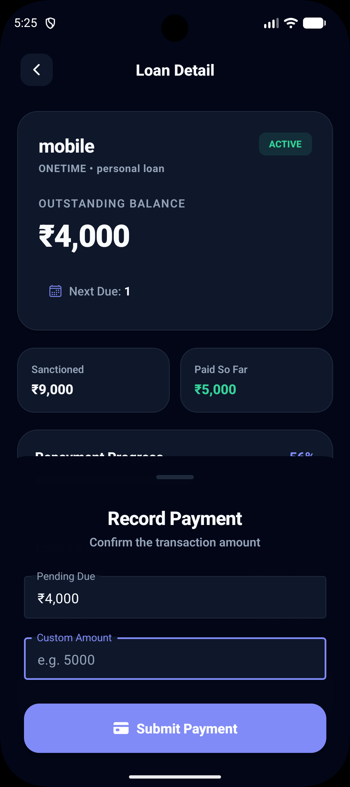

# 💳 LoanTracker

[]()
[]()
[]()
[]()

**LoanTracker** is a premium full-stack mobile suite designed to manage financial lending and debt relationships. Optimized for performance and clarity, it allows users to track personal loans, borrower histories, and repayment schedules in a high-contrast, modern interface.

---

## 🎨 Visual Experience

<div align="center">
  <table width="100%">
    <tr>
      <td align="center" width="33%">
        
        <p>Real-time financial summaries and metrics.</p>
      </td>
      <td align="center" width="33%">
        
        <p>Track Active, Upcoming, and Closed loans.</p>
      </td>
      <td align="center" width="33%">
        
        <p>Comprehensive form for new loan entries.</p>
      </td>
    </tr>
    <tr>
      <td align="center" width="33%">
        
        <p>Manage your lending contacts and history.</p>
      </td>
      <td align="center" width="33%">
        
        <p>profile and theme customization.</p>
      </td>
      <td align="center" width="33%">
        
        <p>Re-payment Option.</p>
      </td>
      <td align="center" width="33%">
        <!-- Grid Spacer -->
      </td>
    </tr>
  </table>
</div>

---

## 🔥 Current Core Features

- **📊 Comprehensive Financial Dashboard**: Get real-time updates on total lent amounts, outstanding dues, and active repayments at a glance.
- **📑 Smart Categorization**: Manage debts seamlessly through specific tabs for **Active**, **Upcoming**, and **Closed** loans.
- **🤝 Borrower Management**: Built-in CRM for managing lending contacts and viewing outstanding balances per individual.
- **🔗 Visual Loan Chain**: A hierarchical representation of linked debts, allowing you to track the flow of funds between lenders and borrowers.
- **📜 Itemized Repayment Logs**: Detailed, unalterable history of every repayment event for full accountability and transparency.
- **💸 Early Repayment Support**: Backend-ready support for partial and early prepayments on existing loans.
- **🌑 Premium UI/UX**: High-contrast dark theme with consistent design tokens, leveraging **React Native Paper** and custom styling for a professional aesthetic.

---

## 🛠️ Tech Stack & Structure

### Technologies

- **Mobile Foundation**: React Native with **Expo Router** (File-based routing)
- **API Runtime**: Node.js & Express.js
- **Data Persistence**: MongoDB with Mongoose ODM
- **State Management**: **Zustand** (Store-based) & **TanStack Query** (API Fetching)
- **Security**: JWT Authentication & Bcrypt Hashing

### Project Organization

- `/frontend`: High-performance mobile client (Expo SDK 53+).
- `/backend`: Scalable REST API (TypeScript).
- `/docs/assets`: Modern, descriptive screenshots showcasing the premium design.

---

## ⚙️ Quick Start

### 1. Environment Configuration

Create a `.env` file in the `backend/` directory:

```env
PORT=5000
MONGO_URI=your_mongodb_connection_string
JWT_SECRET=your_secure_random_key
```

### 2. Unified Deployment

From the project root, you can manage the full stack with combined scripts:

```bash
# Install all dependencies (Backend & Frontend)
# Note: You must run npm install in both /backend and /frontend directories

# Start both services in development mode
npm run dev
```
