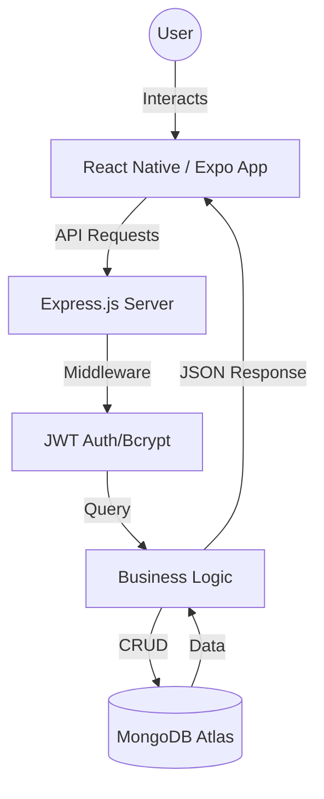

# 💳 LoanTracker

**LoanTracker** is a premium full-stack mobile solution designed for the modern user to manage, track, and visualize personal finance loans and individual debts. Whether you are lending to friends or tracking your own credit card liabilities, LoanTracker provides a unified, secure dashboard to stay on top of your finances.

---

## ✨ Why LoanTracker?

Managing multiple debts can be chaotic. LoanTracker solves this by:

- **Centralizing Data**: No more tracking debts in notes or spreadsheets.
- **Visualizing Relationships**: The unique **Loan Chain** feature allows you to see the source of funds (e.g., specific credit cards) lent to specific individuals.
- **Accountability**: Detailed repayment logs ensure every penny is accounted for.

---

## 📱 Visual Experience

  <table width="100%">
    <tr>
      <td align="center" width="33%">
        
        
<b>Performance Dashboard</b> Real-time analytics and loan tracking.

      </td>
      <td align="center" width="33%">
        
        
<b>Loan Management</b> Track given and taken loans easily.

      </td>
      <td align="center" width="33%">
        
        
<b>Flexible Details</b> Comprehensive loan entry with EMI support.

      </td>
    </tr>
    <tr>
      <td align="center" width="33%">
        
        
<b>Borrower Directory</b> Manage all your lending contacts in one place.

      </td>
      <td align="center" width="33%">
        
        
<b>Premium Settings</b> Dark mode and profile customization.

      </td>
      <td align="center" width="33%">
        <!-- Space for future feature or extra screenshot -->
      </td>
    </tr>
  </table>

---

## 🚀 Key Features

- **🔐 Enterprise-Grade Auth**: Secure JWT-based authentication with encrypted password hashing.
- **📊 Loan Chain Visualization**: View a hierarchical structure of debts. See exactly which credit card or bank loan is fueling the amount you've lent to others.
- **📝 Real-time Repayment Logs**: Historical tracking of all partial and full repayments.
- **📱 Fluid UI/UX**: Built with Expo Router for native-feeling transitions and a clean, minimalist design.
- **🌑 Light/Dark Mode Ready**: Styled with a focus on readability and modern aesthetics.

---

## 🏗️ System Architecture

---

## 🛠️ Tech Stack

### Frontend

- **Framework**: [React Native (Expo)](https://expo.dev/)
- **Architecture**: Expo Router (File-based routing)
- **Language**: TypeScript (Strongly typed for reliability)
- **Styling**: StyleSheet API with a custom premium design system

### Backend

- **Runtime**: [Node.js](https://nodejs.org/)
- **Framework**: [Express.js](https://expressjs.com/)
- **Database**: [MongoDB](https://www.mongodb.com/) (Mongoose ODM)
- **Security**: JWT (Stateless Auth) & Bcrypt (Password Hashing)